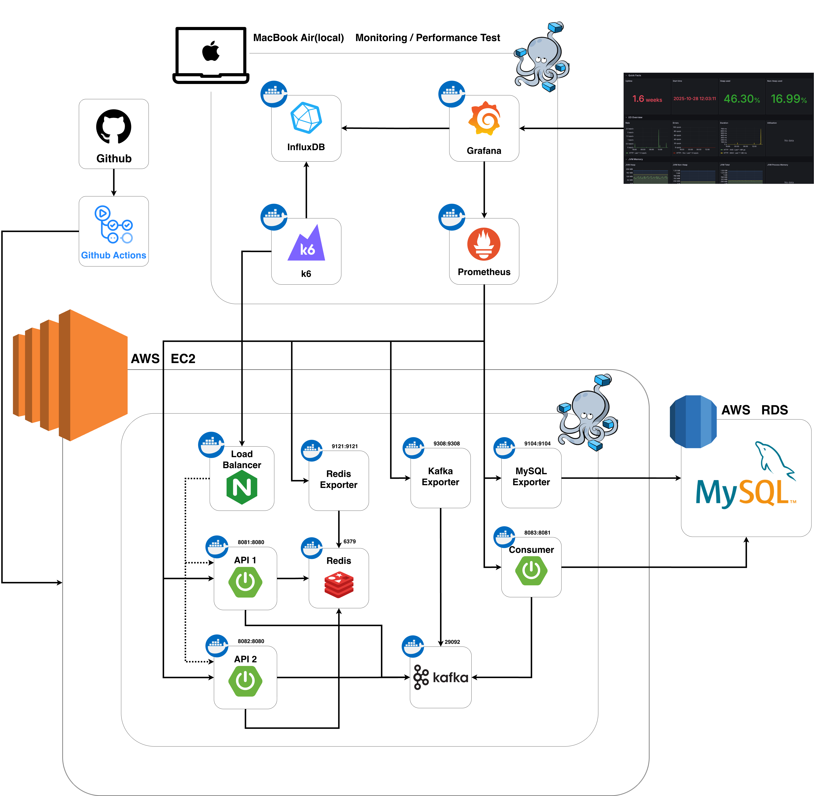
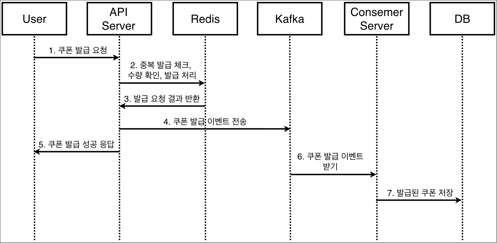
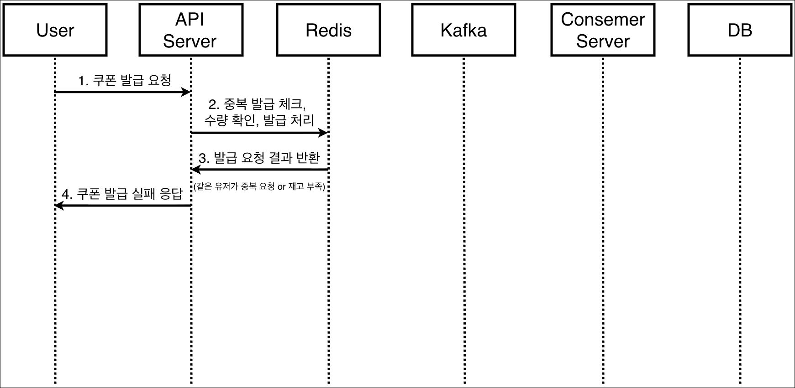
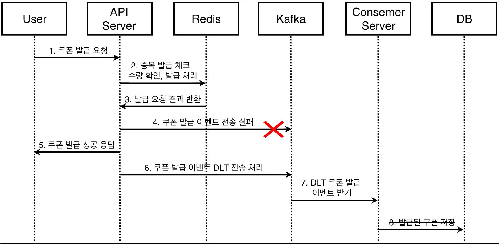
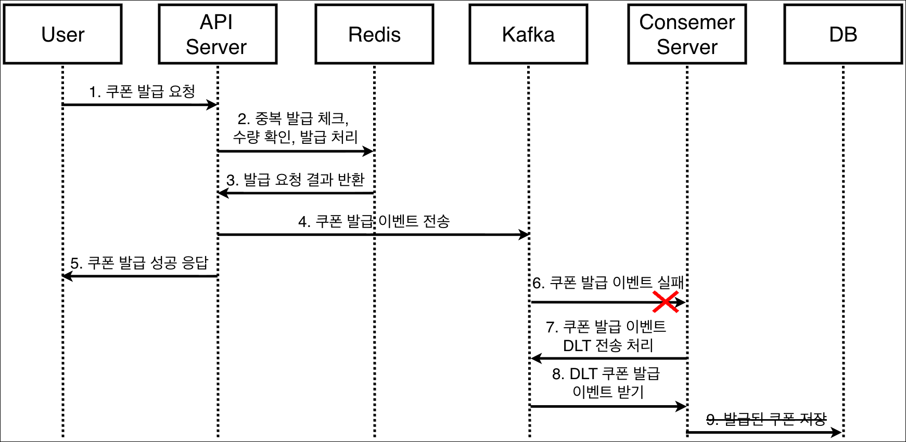

# **선착순 쿠폰 발급 시스템**

# **목차**
1. [프로젝트 개요](#1-프로젝트-개요)
2. [아키텍처](#2-아키텍처)
3. [사용한 기술](#3-사용한-기술)
4. [선착순 쿠폰 발급 기능(시퀀스 다이어그램)](#4-선착순-쿠폰-발급-기능시퀀스-다이어그램)
5. [패키지 구조](#5-패키지-구조)

## 1. 프로젝트 개요
**목표**: 대규모 트래픽을 처리할 수 있는 쿠폰 발급 시스템 설계 및 구현
- 제한된 서버 리소스에서 최대한의 효율을 이끌어 내보기 위한 목적을 가지고 시작
  ### AWS 
- EC2 - t3.medium(2vCPU, 4GB RAM)
- RDS - db.t4g.micro(2vCPU, 1GB RAM)

## 2. 아키텍처


## 3. 사용한 기술
| **분류**                            | **사용한 기술**                                                                                                      |
|-----------------------------------|-----------------------------------------------------------------------------------------------------------------|
| **Backend**                       | Java 21, Kotlin, Spring Boot 3.4.1                                                                              |
| **Database**                      | MySQL 8.0.41, Redis, InfluxDB                                                                                   |
| **Messaging & Streaming**         | Kafka 3.x, KRaft, Kafka-UI                                                                                      |
| **Load Balancer**                 | Nginx                                                                                                           |
| **Containerization**              | Docker                                                                                                          |
| **Build & Dependency Management** | Gradle                                                                                                          |
| **Testing**                       | k6                                                                                                              |
| **Monitoring**                    | Prometheus, Grafana, Prometheus Micrometer, Spring Boot Actuator(JVM (Micrometer), Spring Boot HikariCP / JDBC) |
| **Exporters**                     | mysql-exporter, redis-exporter, kafka-exporter                                                                  |


## 4. 선착순 쿠폰 발급 기능(시퀀스 다이어그램)

### 1) 쿠폰 발급 정상 처리


### 2) 쿠폰 발급 실패 처리


### 3) 쿠폰 발급 성공, Producer 이벤트 전송 실패


### 4) 쿠폰 발급 성공, Consumer 이벤트 처리 실패


## 5. 패키지 구조
```
.
├── HELP.md                                     
├── README.md                                   # 프로젝트 전체 설명
├── build.gradle.kts                            # 루트 프로젝트 빌드 설정 (멀티 모듈 공통 설정 등)
├── coupon-api                                  # [Module] API 서버 (트래픽 접수, 검증, 발행 요청)
│   ├── Dockerfile                              # API 서버 컨테이너 이미지 빌드 명세
│   ├── build.gradle.kts                        # API 모듈 의존성 설정
│   └── src
│       ├── main
│       │   ├── kotlin
│       │   │   └── com
│       │   │       └── woong2e
│       │   │           └── couponsystem
│       │   │               ├── CouponsystemApiApplication.kt # API 서버 실행 진입점
│       │   │               ├── coupon
│       │   │               │   ├── api
│       │   │               │   │   ├── controller
│       │   │               │   │   │   └── CouponController.kt # 쿠폰 발급/조회 HTTP 요청 처리
│       │   │               │   │   └── request
│       │   │               │   │       ├── CouponCreateRequest.kt
│       │   │               │   │       ├── CouponIssueRequest.kt # 쿠폰 발급 요청 DTO
│       │   │               │   │       └── CouponStockInitRequest.kt
│       │   │               │   ├── application
│       │   │               │   │   ├── event
│       │   │               │   │   │   ├── CouponIssueDltEvent.kt # 실패 메시지(DLT) 처리 이벤트
│       │   │               │   │   │   └── CouponIssueEvent.kt    # 쿠폰 발급 이벤트
│       │   │               │   │   ├── port
│       │   │               │   │   │   └── out
│       │   │               │   │   │       └── CouponIssueEventPublisher.kt # 이벤트 발행 인터페이스
│       │   │               │   │   ├── response
│       │   │               │   │   │   ├── CouponIssueResponse.kt
│       │   │               │   │   │   └── CouponResponse.kt
│       │   │               │   │   └── service
│       │   │               │   │       ├── CouponIssueService.kt # 쿠폰 발급 서비스 인터페이스
│       │   │               │   │       ├── CouponService.kt      # 쿠폰 CRUD 기본 서비스
│       │   │               │   │       └── impl # 동시성 제어 전략별 구현체 모음
│       │   │               │   │           ├── AsyncLuaCouponIssueService.kt        # 비동기 + Redis Lua Script 전략
│       │   │               │   │           ├── AtomicCouponIssueService.kt          # Atomic 연산 활용 전략
│       │   │               │   │           ├── AtomicQueryCouponIssueService.kt
│       │   │               │   │           ├── DistributedLockCouponIssueService.kt # Redisson 분산락 전략
│       │   │               │   │           ├── LuaCouponIssueService.kt             # Redis Lua Script 전략
│       │   │               │   │           ├── NoLockCouponIssueService.kt          # 락 없는 상태 (Race Condition 발생)
│       │   │               │   │           ├── PessimisticLockCouponIssueService.kt # DB 비관적 락 전략
│       │   │               │   │           ├── ReentrantLockCouponIssueService.kt   # Java ReentrantLock (단일 인스턴스)
│       │   │               │   │           ├── SemaphoreCouponIssueService.kt       # Java Semaphore 활용 전략
│       │   │               │   │           ├── Synchronized2CouponIssueService.kt
│       │   │               │   │           └── SynchronizedCouponIssueService.kt    # Java synchronized 키워드 전략
│       │   │               │   ├── domain
│       │   │               │   │   ├── entity
│       │   │               │   │   │   ├── Coupon.kt       # 쿠폰 도메인 엔티티
│       │   │               │   │   │   └── IssuedCoupon.kt # 발급된 쿠폰 내역 엔티티
│       │   │               │   │   └── repository
│       │   │               │   │       ├── AppliedUserRepository.kt
│       │   │               │   │       ├── CouponRepository.kt
│       │   │               │   │       └── IssuedCouponRepository.kt
│       │   │               │   ├── infra
│       │   │               │   │   ├── persistence
│       │   │               │   │   │   ├── CouponJpaRepository.kt
│       │   │               │   │   │   └── IssuedCouponJpaRepository.kt
│       │   │               │   │   ├── producer
│       │   │               │   │   │   └── IssuedCouponProducer.kt       # Kafka로 발급 요청 메시지 전송 (Producer)
│       │   │               │   │   └── redis
│       │   │               │   │       ├── AppliedUserRedisRepository.kt # 중복 발급 방지용 Redis Set 저장소
│       │   │               │   │       └── CouponRedisRepository.kt
│       │   │               │   ├── status
│       │   │               │   │   └── CouponErrorStatus.kt
│       │   │               │   └── value
│       │   │               │       └── DltSource.kt
│       │   │               ├── global
│       │   │               │   ├── annotaion
│       │   │               │   │   └── Bulkhead.kt # 벌크헤드 패턴 적용을 위한 어노테이션
│       │   │               │   ├── aop
│       │   │               │   │   └── BulkheadAspect.kt # 벌크헤드 패턴 AOP 구현 (장애 격리)
│       │   │               │   ├── exception
│       │   │               │   │   ├── CustomException.kt
│       │   │               │   │   └── GlobalExceptionHandler.kt # 전역 예외 처리기
│       │   │               │   ├── jpa
│       │   │               │   │   ├── JpaConfig.kt
│       │   │               │   │   └── PrimaryKeyEntity.kt # 공통 Base Entity
│       │   │               │   └── response
│       │   │               │       ├── ApiResponse.kt # 공통 응답 Wrapper
│       │   │               │       ├── code
│       │   │               │       │   ├── BaseCode.kt
│       │   │               │       │   └── BaseErrorStatus.kt
│       │   │               │       └── status
│       │   │               │           ├── ErrorStatus.kt
│       │   │               │           └── SuccessStatus.kt
│       │   │               ├── infra
│       │   │               │   ├── kafka
│       │   │               │   │   ├── KafkaProducerConfig.kt # Kafka Producer 설정 (직렬화 등)
│       │   │               │   │   └── KafkaTopicConfig.kt    # 토픽 생성 및 설정
│       │   │               │   ├── lock
│       │   │               │   │   ├── DistributedLockExecutor.kt # 분산락 실행기 인터페이스
│       │   │               │   │   └── impl
│       │   │               │   │       ├── LettuceLockExecutor.kt  # Lettuce 기반 락 (Spin Lock 직접 구현 시)
│       │   │               │   │       └── RedissonLockExecutor.kt # Redisson 기반 분산락
│       │   │               │   └── redis
│       │   │               │       ├── RedisConfig.kt
│       │   │               │       └── RedissonConfig.kt
│       │   │               └── user
│       │   │                   └── domin
│       │   │                       └── User.kt
│       │   └── resources
│       │       ├── application-local.yml   # 로컬 개발 환경 설정
│       │       ├── application-prod.yml    # 운영 환경 설정
│       │       ├── application.yml         # 공통 설정
│       │       ├── sql
│       │       │   ├── data.sql            # 초기 데이터 (더미 데이터 등)
│       │       │   └── schema.sql          # 테이블 스키마 정의
│       │       ├── static
│       │       └── templates
│       └── test
│           ├── kotlin
│           │   └── com
│           │       └── woong2e
│           │           └── couponsystem
│           │               └── CouponsystemApiApplicationTests.kt # 통합 테스트 등
│           └── resources
│               └── application-test.yml
├── coupon-consumer                             # [Module] 컨슈머 서버 (비동기 처리, DB 적재)
│   ├── Dockerfile                              # 컨슈머 서버 컨테이너 이미지 빌드 명세
│   ├── build.gradle.kts                        # 컨슈머 모듈 의존성 (Kafka Consumer, JDBC 등)
│   ├── coupon-consumer.iml
│   └── src
│       ├── main
│       │   ├── kotlin
│       │   │   └── com
│       │   │       └── woong2e
│       │   │           └── couponsystem
│       │   │               ├── CouponsystemConsumerApplication.kt # 컨슈머 서버 실행 진입점
│       │   │               ├── coupon
│       │   │               │   ├── application
│       │   │               │   │   ├── port
│       │   │               │   │   │   └── out
│       │   │               │   │   │       └── CouponIssueDltPublisher.kt
│       │   │               │   │   └── service
│       │   │               │   │       └── CouponIssueWorkerService.kt # 실제 발급 로직 처리
│       │   │               │   ├── consumer
│       │   │               │   │   ├── event
│       │   │               │   │   │   ├── CouponIssueDltEvent.kt
│       │   │               │   │   │   └── CouponIssueEvent.kt
│       │   │               │   │   └── listener
│       │   │               │   │       └── CouponIssueConsumer.kt # Kafka 메시지 수신 (Listener)
│       │   │               │   ├── domain
│       │   │               │   │   ├── entity
│       │   │               │   │   │   ├── Coupon.kt
│       │   │               │   │   │   └── IssuedCoupon.kt
│       │   │               │   │   └── repository
│       │   │               │   │       ├── IssuedCouponBatchRepository.kt # Bulk Insert용 레포지토리
│       │   │               │   │       └── IssuedCouponRepository.kt
│       │   │               │   ├── infra
│       │   │               │   │   ├── kafka
│       │   │               │   │   │   └── KafkaCouponIssueDltPublisher.kt # 실패 메시지 재발행/DLT 전송
│       │   │               │   │   └── persistence
│       │   │               │   │       ├── IssuedCouponJdbcRepository.kt # JDBC Batch Update 구현
│       │   │               │   │       └── IssuedCouponJpaRepository.kt
│       │   │               │   ├── status
│       │   │               │   │   └── CouponErrorStatus.kt
│       │   │               │   └── value
│       │   │               │       └── DltSource.kt
│       │   │               ├── global
│       │   │               │   ├── exception
│       │   │               │   │   ├── CustomException.kt
│       │   │               │   │   └── GlobalExceptionHandler.kt
│       │   │               │   ├── jpa
│       │   │               │   │   ├── JpaConfig.kt
│       │   │               │   │   └── PrimaryKeyEntity.kt
│       │   │               │   └── response
│       │   │               │       ├── ApiResponse.kt
│       │   │               │       ├── code
│       │   │               │       │   ├── BaseCode.kt
│       │   │               │       │   └── BaseErrorStatus.kt
│       │   │               │       └── status
│       │   │               │           ├── ErrorStatus.kt
│       │   │               │           └── SuccessStatus.kt
│       │   │               ├── infra
│       │   │               │   └── kafka
│       │   │               │       └── KafkaConsumerConfig.kt # Kafka Consumer 설정 (Offset 전략, Batch Listener 등)
│       │   │               └── user
│       │   │                   └── domin
│       │   │                       └── User.kt
│       │   └── resources
│       │       ├── application-local.yml
│       │       ├── application-prod.yml
│       │       ├── application.yml
│       │       ├── static
│       │       └── templates
│       └── test
│           ├── kotlin
│           │   └── com
│           │       └── woong2e
│           │           └── couponsystem
│           │               └── CouponsystemConsumerApplicationTests.kt
│           └── resources
│               └── application-test.yml
├── deploy
│   └── deploy.sh                               # 배포 스크립트 (CI/CD 파이프라인 연동용)
├── docker-compose
│   ├── docker-compose-database.yml             # DB (Redis, exporter 등) 컨테이너 구성
│   ├── docker-compose-kafka.yml                # Kafka(Kraft) 컨테이너 구성
│   └── docker-compose.yml                      # 전체 서비스
├── nginx
│   └── nginx.conf                              # 로드밸런싱 또는 리버스 프록시 설정
└── settings.gradle.kts                         # 멀티 모듈 관리 설정

```